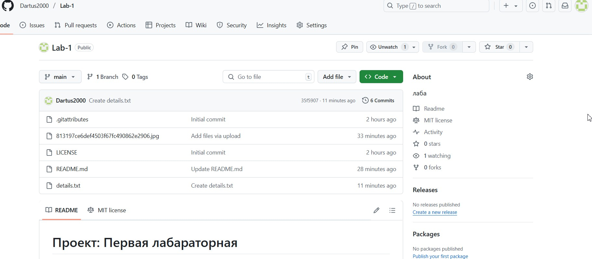

# Проект: Лабараторная 2

Добро пожаловать в мой новый репозиторий! Здесь вы найдете описание проекта, инструкции по установке и использованию.

## Цели
1. Освоить механизм обновления репозитория и взаимодействия с платформой GitHub через команду push.
2. Познакомиться с процессом создания, изменения и слияния веток на GitHub, включая разрешение конфликтов через веб-интерфейс.
3. Овладеть продвинутыми командами управления историей изменений в Git, такими как rebase и cherry-pick.
4. Понять принципы работы команд fetch и pull для синхронизации локального репозитория с удаленным.
      

## Ход работы:

1. Обновление репозитория и работа с командой push (изображение 1)

```markdown

```

2. Работа с ветками, pull request и веб-интерфейсом GitHub (2,3,4).
3. Работа с командой rebase.
4. Применение команды cherry-pick